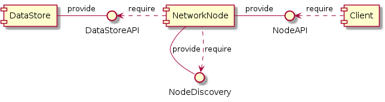

# Distributed Kanban Board

This piece of software gives the user access to a kanban board which is synced across multiple nodes in a local network.

## Requirements 

- The user can create an user account
	- an user account has a name
	- an user account has a signature (generated using a password)
- The user can create a project inside of which columns can be created
	- a project has a name
	- a project has an uuid to prevent datastore conflicts
- The user can create a column in which tasks can be placed
	- a column has a name which is unique inside of the project
- The user can create a task
	- a task has a name which is unique inside of the project
	- a task has a column
	- a task can have a description
	- a task can have a deadline
	- a task can have a time estimate
- Columns and tasks are synced with other nodes in the network
	- addition and deletion of columns or tasks should be reversible
	- the user should be able to view the history of changes and what user made them
	- the changes should be communicated to other nodes as fast as possible
- Nodes in a network should at all times agree on the current content of the board
	- Nodes should use hashing on their local content and verify that the hash matches the hash of other nodes
	- If a conflict occurs (on the same project) the database content should be reverted to a point where this was not so
- Changes on the kanban board should at all times be traceable to a user

## Architecture

The architecture of this software consists of three main components:
- The DataStore
- The NetworkNode
- The Client

The DataStore is the place where all information about users and tasks is stored.
The NetworkNode allows for interfacing to the DataStore over the network by other nodes but also clients.
The Client here can be any application that interfaces with the network node using HTTP.

This will look something like this:

interface descriptions

| interface     | description                                                                                                   |
| ------------- | ------------------------------------------------------------------------------------------------------------- |
| DataStoreAPI  | A python module interface that allows for the creation and management of objects inside of the LocalDataStore |
| NodeDiscovery | This is an UDP socket which allows new nodes to announce themselves to the network                            |
| NodeAPI       | This is an HTTP API which allows both client applications and other nodes to update values on the node        |

the interfaces will provide the following functions

| interface     | function            | description                                                                           |
| ------------- | ------------------- | ------------------------------------------------------------------------------------- |
| DataStoreAPI  | create column       | Creates a new column using a given name                                               |
|               | delete column       | deletes the column and its tasks                                                      |
|               | create task         | creates a new task with the given name, column and optionally other attributes        |
|               | update task         | updates an attribute of a task with the given name                                    |
|               | delete task         | deletes the task from the datastore                                                   |
|               | get task by name    | returns the task along with all its attributes according to its name                  |
|               | get tasks in column | returns all the task names inside of a give column                                    |
|               | create user         | Creates a new user with an username and signature using a given username and password |
|               | delete user         | removes a user with the given username                                                |
| NodeDiscovery | announce            | Allows new nodes to announce themselves to the network                                |
| NodeAPI       | *DataStore*         | Implements the same functions as the DataStore but as an HTTP API                     |

### Data storage

Data will be stored as transactions made with the data store. This way the transactions will be reversible and conflicts can be resolved based on the timestamp of the transaction to get everything back in order.

